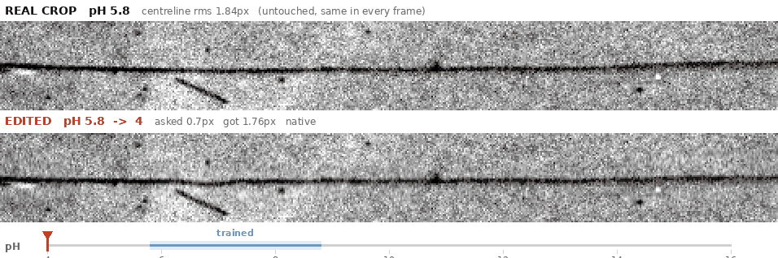
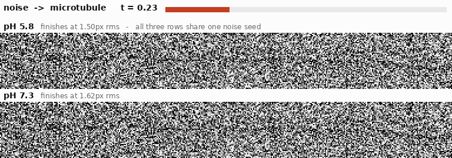
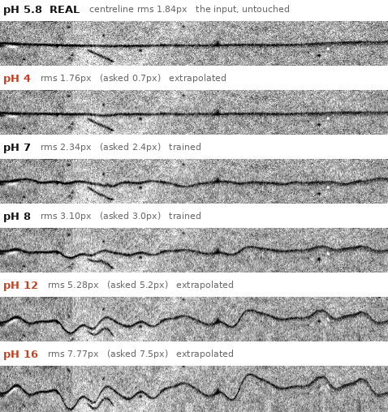
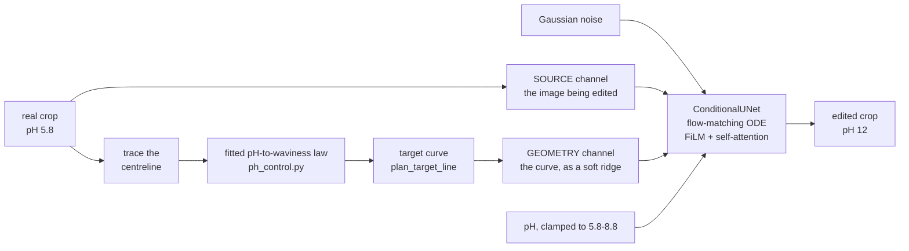

<h1 align="center">Wiggly Image Synthesis</h1>

<p align="center">
  <b>What would this microtubule look like at a different pH?</b><br>
  A pH-conditioned flow-matching model that edits real microscopy images of protein fibres —
  and keeps working well outside the pH range it was trained on.
</p>

<p align="center">
  
  
  
  
</p>

<p align="center">
  
</p>

<p align="center">
  <sub>One <b>real</b> crop, photographed once at pH 5.8. Every frame below it is that same
  fibre re-rendered at a requested pH. Only the shaded stretch of the dial is pH the model
  has ever seen data from.</sub>
</p>

---

Microtubules are protein fibres, and their shape depends on the pH of the buffer around them:
**low pH keeps them flat and straight, high pH makes them buckle into waves.** This project
learns that relationship from 416 real microscopy crops spanning pH 5.8–8.8, and then answers
the counterfactual — *this exact fibre, at a pH it was never photographed at.*

It is not a "generate a plausible microtubule" model. The input image is the subject: the fibre
that comes out is the one that went in, with the same grain, the same contrast, the same dust
specks, bent into a new shape.

## Watch it build an image out of noise

<p align="center">
  
</p>

Flow matching learns a velocity field that carries pure Gaussian noise to a real image along a
straight-line path, and sampling is just integrating that field from `t=0` to `t=1`. All three
rows above start from **the same noise seed** and run the same solver — the only difference is
the pH they are conditioned on — and well before the picture resolves, at around `t≈0.75`, the
pH 8.8 fibre is already carrying undulations the pH 5.8 one never develops.

```bash
python3 sample.py --pH 5.8 6.4 7.0 7.4 8.2 8.8 --num_steps 1000
```

## Setup

```bash
pip install -r requirements.txt
```

Then download the trained checkpoint per [`checkpoints/download_trained_model.txt`](checkpoints/download_trained_model.txt)
and save it at `checkpoints/cfm_best_ema_geom.pt` — that path is `config.CHECKPOINT_PATH`, which
every script defaults to, so you never have to pass `--checkpoint`. Nothing in the repo works
without it. A GPU is optional; everything falls back to CPU, just much slower.

## Quick start — edit one image

```bash
python3 img2img.py \
    --ref_image data/cropped/cropped_output/5.8/20260219_005_Ch3_pos3_MES_pH5_frame0000_crop00.png \
    --source_pH 5.8 --target_pH 8.8 --num_steps 100
```

Opens a comparison plot (original / edited / difference) and writes the result to
`outputs_img2img/`. To sweep a whole pH range at once, headlessly, with every result captioned
and saved to disk:

```bash
python3 sweep_ph.py \
    --ref_image data/cropped/cropped_output/5.8/20260219_005_Ch3_pos3_MES_pH5_frame0000_crop00.png \
    --source_pH 5.8 --pH_min 4 --pH_max 16 --pH_step 1
```

## What actually comes out

<p align="center">
  
</p>

Shape is measured, not eyeballed: **centreline rms** is how far the traced fibre strays from
straight, in pixels. On the crop above (a near-flat 1.84px source at pH 5.8) the request and the
result track each other closely, well past the trained band:

| requested pH | 6 | 8 | 10 | 12 | 14 | 16 |
|---|---|---|---|---|---|---|
| **asked for** (px rms) | 1.8 | 3.0 | 4.1 | 5.2 | 6.4 | 7.5 |
| **measured back** (px rms) | 1.91 | 3.10 | 4.15 | 5.28 | 6.48 | 7.77 |

Going the other way has a floor, and the figures say so rather than hiding it: asked for 0.7px
at pH 4 this crop returns 1.76px, because it was already almost straight and there is very
little excursion left to take away.

## How it works



Three things are worth pulling out.

**The model is trained on the editing task directly**, not on "turn noise into a microtubule".
Every training sample is a `(source, target)` pair — a real crop and a bent version of it, in a
randomised direction, so the network learns to straighten as readily as to bend. The source
arrives clean in its own input channel at every ODE step, which is why there is no `--strength`
knob to tune: the trajectory starts from pure noise and runs the whole way, and the old fibre is
never present to be half-erased.

**Shape is requested as a picture, not as a number.** The third input channel carries the
*target centreline itself*, rendered as a soft ridge. Summary statistics are ambiguous —
infinitely many curves share one rms — so a model given only a number has to average over a
phase nobody told it, and it hedges by painting a faint smear. Handed the actual curve, it knows
exactly where to put the fibre and draws it sharply.

**That is also how extrapolation works.** pH enters through a Fourier embedding, which is
periodic: feed it pH 11.8 and it does not extrapolate, it *aliases* — measured on the trained
embedding, pH 11.8 sits exactly as close to pH 8.8 as pH 5.8 does. So an out-of-range request
never reaches the embedding. The fitted pH→waviness law converts it into a target curve, the pH
itself is clamped back into 5.8–8.8, and the request lands on the **geometry** axis instead —
which the training augmentation populates continuously, all the way past what a pH 16 request
asks for. A far out-of-range pH becomes an in-distribution *shape*.

## The knobs that matter

| flag | default | what it does |
|---|---|---|
| `--target_pH` | *required* | where you want the fibre to end up. Any value; outside 5.8–8.8 it routes through `ph_warp.edit_to_pH` exactly as it does inside — only the law's target changes. |
| `--geometry_mode` | `auto` | `auto` follows the checkpoint. On this one it means `native`: the model draws every pixel from the target curve. `warp` is the older split — the model re-renders texture while a displacement field moves real pixels — kept for comparison on pre-geometry checkpoints. |
| `--waviness_mode` | `relative` | scale *this* fibre's own excursion by the ratio the law predicts. `absolute` snaps it to the population average for the target pH, which discards the individual crop (real crops at one pH span 0.69–9.33px around a 4.12px mean) and makes an X→X edit not the identity. |
| `--num_steps` | `100` | ODE steps. More is smoother and slower. |
| `--solver` | `heun` | 2nd-order predictor–corrector; ~2.6× lower trajectory error than `euler` at matched step count, ~1.9× even at matched compute. |
| `--contrast` / `--contrast_mode` | `2.0` / `linear` | post-processing only. `linear` rescales around the image mean and preserves brightness; `gamma` is the legacy `img**c` behaviour, kept to reproduce old runs. **Keep it identical on both sides of any real-vs-generated comparison.** |
| `--strength` | `0.65` | **ignored** by the current source-conditioned checkpoint, which starts from noise. It only drives the legacy SDEdit path on 1-channel checkpoints. |

## Did it learn the conditioning, or just the images?

Flow-matching MSE is nearly blind to conditioning, so training tracks a second number: the
**conditioning gap** — the same validation loss with a channel forced to its null embedding,
minus the loss with it supplied.

| | best val loss | geometry gap | waviness gap | ripple gap |
|---|---|---|---|---|
| step 49,500 | **0.0484** | **+0.0246** | −0.000004 | +0.000026 |

Blanking the geometry channel **raises the validation loss by half again**, 0.0484 to 0.073.
That is the channel doing the work. The two scalar geometry channels read as zero, which is the expected outcome and not a
failure: once the model is handed the curve itself, summaries of that curve are redundant. Their
predecessors — earlier generations that had *only* the scalars — moved the loss by ~1e-4, an
order of magnitude below the run-to-run noise in the metric that decides when training stops.

```bash
python3 train.py            # writes outputs/training_loss{,_conditioning}.png + .csv
python3 calibrate_ph.py     # re-fit the pH↔waviness law for a new checkpoint
```

## Checking a new checkpoint

Waviness alone cannot tell "ten small ripples" from "one long arc" — an amplitude-`A` wave scores
`A/√2` either way, while the bending cost goes as `A/L`, so a model told only the rms draws the
cheapest thing that satisfies it. The check that *can* tell them apart compares rms per
wavelength band against real crops:

```bash
python3 test_wave_spectrum.py --source_pH 5.8 --target_pH 8.8   # + fibre depth and continuity
python3 test_img2img.py --contrastive_scales 1 3 5 --num_steps 50
python3 eval_metrics_dino.py    # KID (primary) + FID, DINOv2 backbone
```

KID, not FID, is the number to trust here: per-pH sample counts are 36–136 images, which makes
an Inception covariance near-singular, and ImageNet features are domain-mismatched for
grayscale microscopy in the first place.

## Honest limits

- **The pH→waviness law is a straight line through seven bucket means**, extrapolated past the
  data. It fits those means well (Pearson r = +0.84 between pH and mean centreline rms), but
  individual crops scatter hugely around it — per-crop R² is only ~0.07, and real crops at one
  pH span 0.69–9.33px around a 4.12px mean. That is why `--waviness_mode relative` is the
  default: the law supplies a *ratio* to move this fibre by, never an absolute answer. A pH 16
  request is a statement about geometry, not evidence about real chemistry at pH 16.
- **The reach is bounded by the crop's own height.** A 60px-tall crop tracks the law all the way
  out; a 47px one plateaus around pH 11, because the shear needed to push 13px of excursion
  through a 47px frame would tear the texture. `img2img.py` prints the shortfall rather than
  letting it pass silently.
- **About half the dataset is too small to edit well** — crops narrower than the trained window
  get mirror-tiled first, which shows. `test_img2img.py` skips them for that reason.
- **`ph_calibration.json` is checkpoint-specific.** Re-run `calibrate_ph.py` after a retrain or
  the fitted constants silently belong to a different model.

## Repo map

| | |
|---|---|
| `img2img.py` | the deliverable: edit one real image to a target pH |
| `sweep_ph.py` | headless sweep of one image across many pH values, captioned to disk |
| `sample.py` | unconditional-style generation from noise, for sanity checks |
| `train.py` · `dataset.py` · `framing.py` | training, data loading, and frame geometry |
| `model.py` | `ConditionalUNet` — always load with `from_state_dict()`, never bare |
| `ph_control.py` · `ph_warp.py` · `waviness.py` | the fitted laws, the target curve, the shape measurements |
| `calibrate_ph.py` | re-fit the laws for a checkpoint |
| `test_*.py` | headless diagnostic sweeps (figures for a human to read, not assertions) |
| `eval_*.py` · `dino_features.py` | FID / KID evaluation |
| `make_readme_assets.py` | regenerates every animation and figure on this page |

**[`HOW_TO_RUN.md`](HOW_TO_RUN.md)** is the full command reference.
**[`PROJECT_OVERVIEW.md`](PROJECT_OVERVIEW.md)** explains the reasoning behind each design choice.
**[`CLAUDE.md`](CLAUDE.md)** is the dense, file-by-file record of what was tried, what was
measured, and what broke.
